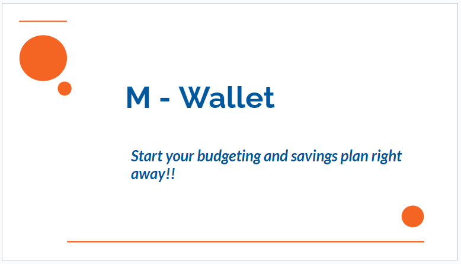

# M-Wallet

*Start your budgeting and savings journey right away!!*

## Table of Contents

- [Introduction](#introduction)
- [The Team](#the-team)
- [Technologies And Architecture](#technologies-and-architecture)
- [Third Party Services Used](#third-party-services-used)
- [API Endpoints](#api-endpoints)
- [Mockups](#mockups)
- [Work Schedule](#work-schedule)
- [Presentation Slides](#presentation-slides)
- [GitHub Repository](#github-repository)

## Introduction

Budgeting and financial planning are genuinely difficult tasks, especially when focusing on immediate and short-term objectives. It's difficult to keep track of your weekly expenses as well. As a financial platform that enables users to set budgeting objectives, schedule goals, and begin saving toward the goals, M-Wallet steps in to address the issue. This makes it simple to obtain metrics and have a complete picture of expenditures.

You can learn more in the [M-Wallet blog](https://facebook.github.io/create-react-app/docs/getting-started).

## The Team

- Timothy Munene Kariuki: ALX Software engineering student
**GitHub**: [view profile](https://github.com/timmoh-king)
**LinkedIn**: [view profile](https://www.linkedin.com/in/timothy-kariuki-3t6s/)

## Learning Objectives

- Learning how to accurately define and plan the scope of a project to ensure that it meets the MVP needs and expectations.
- Learning how to design and implement a RESTful API that allows for easy and efficient communication between different parts of a system or between different systems.
- Learning how to use the React JavaScript library to build user interfaces and manage the state of an application.
- Learning how to deploy a website to a server and make it accessible to users on the internet.

## API Endpoints

The Qquiz API provides the following endpoints:

| Method | Endpoint | Description |
| ------ | -------- | ----------- |
| POST  | /api/signin | Validate the user's email and password, create a session for the authenticated user, and set a cookie with the session ID. Return a JSON representation of the user object or an error message. |
| POST | api/signup | Create a new user account with some data and return a JSON representation of the user object or an error message. |
| GET | api/users | Get all user accounts with some data and return a JSON representation of the user object or an error message. |
| POST | api/goals | Create a new user goal with some data and return a JSON representation of the user object or an error message. |
| GET | api/goals | Get all goals with some data and return a JSON representation of the user object or an error message. |
| POST | api/new_wallet | Create a new user wallet with some data and return a JSON representation of the user object or an error message. |
| GET | api/user_wallets | Get all user wallets with some data and return a JSON representation of the user object or an error message. |
| POST | api/stk_push | Initialize a transaction with some data and return a JSON representation of the user object or an error message. |

## Technologies And Architecture

- **React Js**: JavaScript library for building  user interfaces
- **Node Js**: JavaScript framework used used to create server-side and networking applications
- **Express**: Web application framework for Node Js that assists in HTTP and building APIs
- **MongoDB**: NoSQL database that uses JSON-like documents with dynamic schemas

## Third Party Services Used

- **Vercel**: Cloud platform as a service (PaaS), which enables developers to build, run, and operate applications entirely in the cloud.
- **Mpesa Daraja API**: Allows users to make secure mobile money transactions from one registered line to another account

## Mockups

The mockups for the M-wallet project is available [here](https://www.figma.com/file/lwIMLHnQmWRb7VgqPG4yZY/M-Wallet?type=design&node-id=1-14&mode=design&t=IjMA0AKQIRFHIC7d-0)

## Work Schedule

The work schedule for the M-wallet project is available [here](https://trello.com/invite/b/tGyJXEqC/ATTIb98e923424334bd7bf620de0229795304D1392B1/m-wallet)

## Presentation Slides

The presentation slides for the M-wallet project is available [here](https://docs.google.com/presentation/d/104XVfkRPSAnoIl-r3IKOWhxmqAHUu7m30oES42RcZL0/edit?usp=sharing)

## GitHub repository

The GitHub repository link for the M-wallet project is available [here](https://github.com/timmoh-king/m-wallet.git)

## M-Wallet Environment Variables

Environment variables are used to store sensitive or configurable information that should not be exposed in the code. They are usually set in a separate file or in the terminal before running the application. For M-Wallet, the following environment variables are required:
- MONGO_URI: MongoDB secret link to allow connection to the cluster
- SECRET: secret key to allow assigning of JWT token
- PORT: port number of the M-Wallet API server

To run the M-Wallet API server, you need to use this command:

`nodemon index.js`

To ensure that node version 16 installs in Ubuntu 22.04, you need to run this command:

`sudo apt-upgrade sudo apt-intall`
`sudo apt-get install node`
